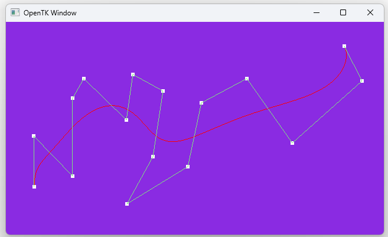

# Bezier-Curves with-OpenTK
Tool to create and display Bezier Curves with OpenTK | C#

**Julius Steinbach**  
Modul: ComputerGrafik
Betreuer: Prof. Dr. Christof Rezk-Salama  
Trier, 01.06.2024

Dieses Projekt demonstriert die interaktive Erstellung von Bézier-Kurven mithilfe der OpenGL-Bibliothek **OpenTK** in **C#**. Es wurde im Rahmen eines Testats zur Vorlesung *"KI für Spiele"* umgesetzt und zeigt die Anwendung von Polynomkurven in einer grafischen Oberfläche.

## Ziel der Anwendung

Die Anwendung erlaubt es, durch Mausklicks Kontrollpunkte zu setzen, aus denen automatisch Bézier-Kurven berechnet und gezeichnet werden. Die Darstellung erfolgt in Echtzeit unter Verwendung einfacher OpenGL-Primitiven.

## Features

- Erzeugen von Punkten durch Mausklicks
- Darstellung der Kontrollpunkte
- Zeichnung des Kontrollpolygons (in anderer Farbe)
- Automatische Berechnung und Darstellung der Bézier-Kurve bei jedem neuen Punkt
- Reset-Funktion durch Drücken der **`R`-Taste**

## Technische Details

- Implementierung des de-Casteljau-Algorithmus zur Kurvenauswertung
- Verwendung der Klasse `NonIndexedGeometry` aus den Übungsstunden zur Darstellung von Punkten, Linien und Kurven
- Darstellung mithilfe von OpenGL-Primitiven (`LineStrip`, `Points`)
- Steuerung der Punktgröße über `GL.PointSize()`

## Technologien

- Sprache: C#
- Bibliothek: [OpenTK](https://opentk.net/)
- Plattform: .NET / Visual Studio

##  Ausführen

1. Projekt in Visual Studio öffnen
2. Build starten (`Strg + Shift + B`)
3. Anwendung ausführen (`F5`)

